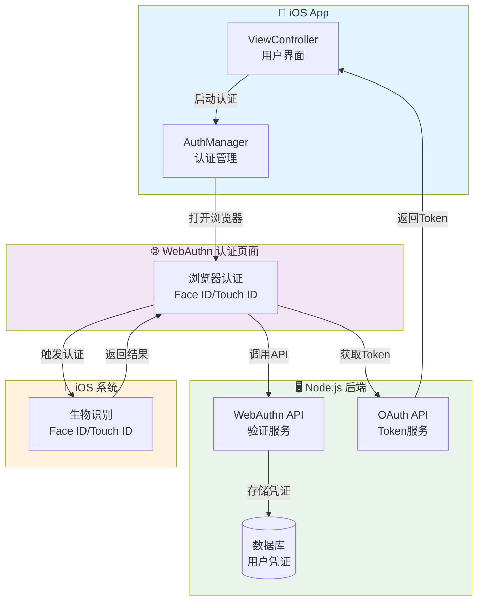
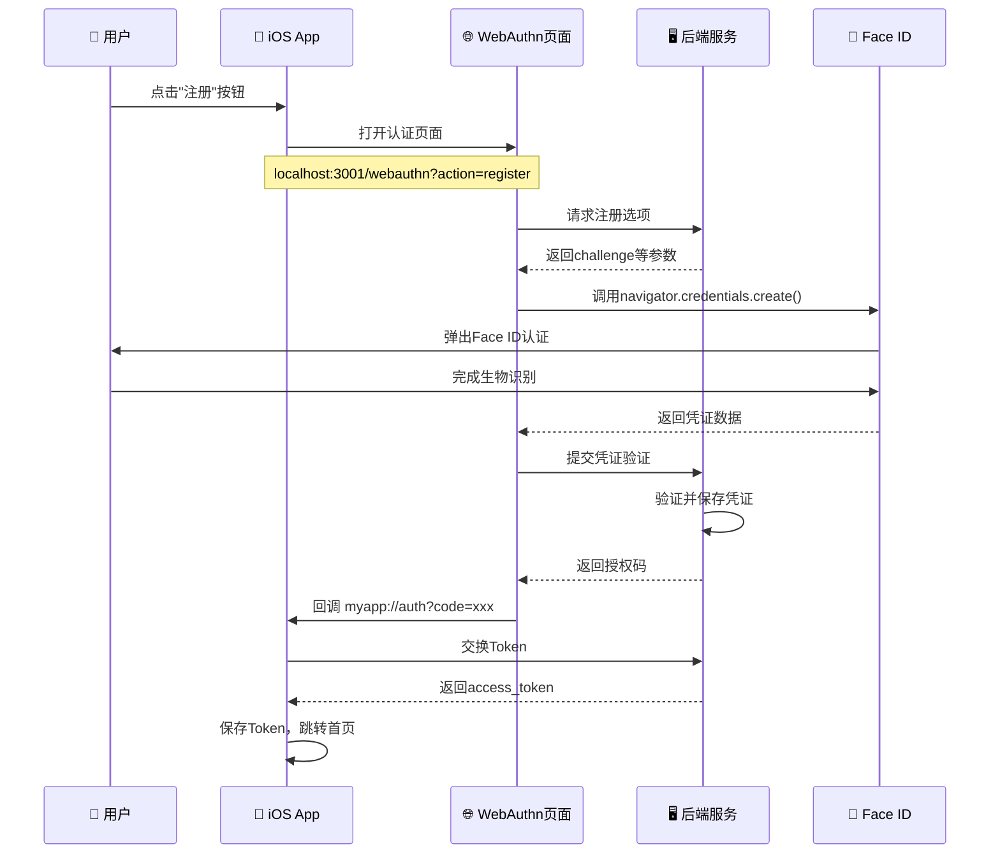
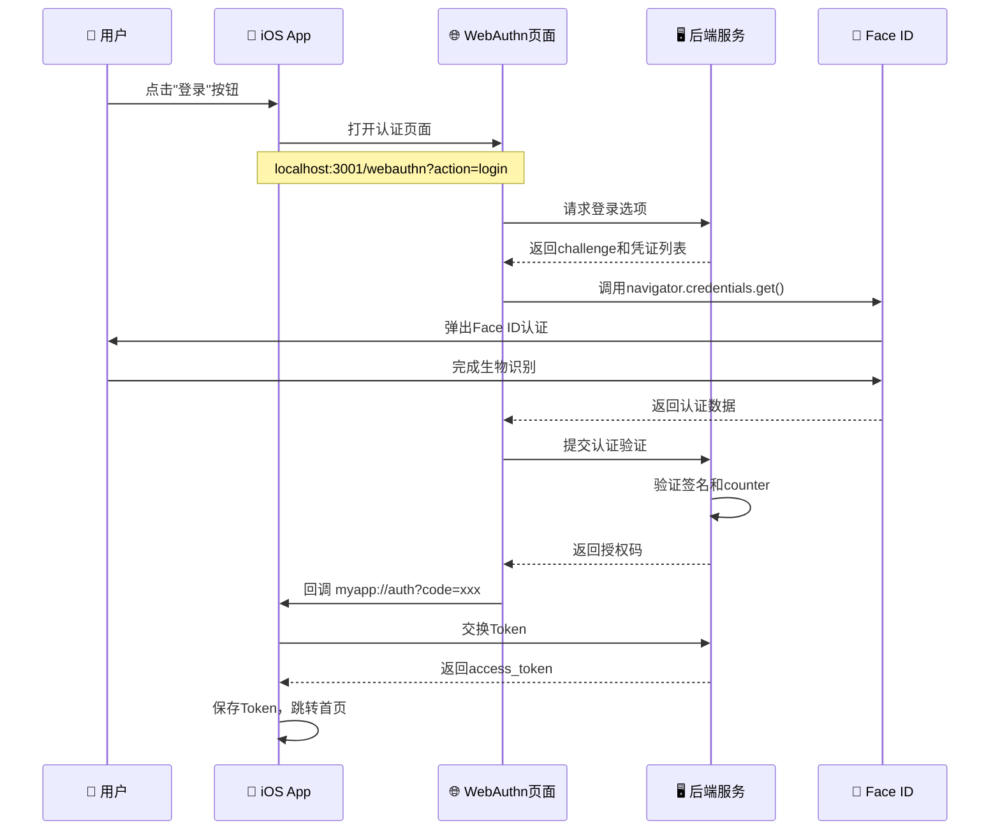

# Passkey Demo 架构文档

## 系统架构图



## 注册流程



## 登录流程



## 组件职责

### 1. iOS App (Swift)
**文件**: `ios/ViewController.swift`, `ios/AuthManager.swift`

**职责**:
- 提供用户界面（登录/注册/首页）
- 管理用户会话和token
- 调用`ASWebAuthenticationSession`启动认证流程
- 处理OAuth回调
- 认证页面模式切换

### 2. WebAuthn 认证页面 (HTML/JavaScript)
**文件**: `web/index.html`, `web/branded.html`

**职责**:
- 调用浏览器的`navigator.credentials` API
- 触发iOS系统的生物识别
- 与后端API通信
- 处理成功/失败状态
- 重定向回iOS App

**特点**:
- **原生浏览器认证**: 利用iOS Safari的WebAuthn能力
- **自适应UI**: 根据参数切换透明/品牌模式

### 3. Node.js 后端 (Express)
**文件**: `server/index.js`

**职责**:
- WebAuthn注册/登录选项生成
- 凭证验证和存储
- OAuth授权码/Token管理
- 用户状态管理（防重复注册）
- 静态文件服务

**端点**:
- `POST /webauthn/registration/options` - 生成注册选项
- `POST /webauthn/registration/verify` - 验证注册
- `POST /webauthn/authentication/options` - 生成登录选项
- `POST /webauthn/authentication/verify` - 验证登录
- `POST /oauth/token` - 交换access_token
- `GET /api/user` - 获取用户信息

### 4. iOS 系统 (Face ID/Touch ID)
**原生能力**:
- 生物识别认证
- 安全密钥存储
- WebAuthn协议支持

## 数据流

```
用户输入 → iOS UI → AuthManager → WebAuthn页面 → 后端API → 数据库
                ↑                      ↓
                ← OAuth Token ← 授权码 ←
```

## 安全机制

1. **Challenge-Response**: 每次认证使用随机challenge，防止重放攻击
2. **生物识别**: Face ID/Touch ID确保是本人操作
3. **HTTPS**: 生产环境必须使用HTTPS（开发环境HTTP仅供测试）
4. **Token过期**: JWT Token带有过期时间
5. **防重复注册**: 后端检查用户是否已有凭证

## 可合并的组件

当前架构中，以下组件可以合并：

1. **WebAuthn页面 + Node.js后端**: 可合并为一个服务
2. **OAuth Token + WebAuthn API**: 都在同一个后端，已经合并
3. **透明模式 + 品牌模式**: 可以用一个页面+配置实现

## 部署建议

### 开发环境 (当前)
- iOS App: Xcode本地运行
- WebAuthn认证页面: `localhost:3001`
- Node.js后端: `localhost:3001`

### 生产环境
```
iOS App (App Store)
    ↓
https://your-domain.com (WebAuthn认证页面 + 后端合并)
    ↓
PostgreSQL/MongoDB (持久化存储)
```

## 兼容性分析

### 📱 iOS 设备兼容性

| 组件 | 最低版本要求 | 推荐版本 | 兼容设备 |
|------|-------------|----------|----------|
| **ASWebAuthenticationSession** | iOS 12.0+ | iOS 14.0+ | iPhone 6s 及以上 |
| **WebAuthn API** | iOS 14.0+ | iOS 16.0+ | iPhone 8 及以上 |
| **Face ID** | iPhone X+ | iPhone 12+ | iPhone X, XS, XR, 11, 12, 13, 14, 15 系列 |
| **Touch ID** | iPhone 5s+ | iPhone 8+ | iPhone 5s, 6, 6s, 7, 8, SE 系列 |

### 🔧 技术兼容性

#### iOS 系统要求
- **最低支持**: iOS 14.0 (WebAuthn 支持)
- **推荐版本**: iOS 16.0+ (完整 Passkey 支持)
- **最佳体验**: iOS 17.0+ (最新安全特性)

#### 设备型号支持
```
✅ 完全支持 (iOS 14+ + Face ID/Touch ID):
- iPhone X 及以上 (Face ID)
- iPhone 8/8 Plus (Touch ID)
- iPhone SE (2nd/3rd gen) (Touch ID)
- iPad Pro (2018+) (Face ID)
- iPad Air (3rd gen+) (Touch ID)
- iPad (6th gen+) (Touch ID)

⚠️ 部分支持 (iOS 14+ 但无生物识别):
- iPhone 6s/6s Plus/7/7 Plus (仅密码认证)
- iPad (5th gen) (仅密码认证)

❌ 不支持:
- iPhone 6 及以下
- iPad (4th gen) 及以下
```

#### 浏览器兼容性
- **Safari**: ✅ 完全支持 (iOS 14+)
- **Chrome**: ⚠️ 部分支持 (需要 iOS 16+)
- **Firefox**: ❌ 不支持 WebAuthn
- **Edge**: ⚠️ 部分支持 (需要 iOS 16+)

### 🌐 网络环境要求

#### 开发环境
- **HTTP**: ✅ 支持 (localhost)
- **HTTPS**: ✅ 推荐 (生产环境必需)

#### 生产环境
- **HTTPS**: ✅ 必需 (WebAuthn 安全要求)
- **域名**: ✅ 必需 (WebAuthn 域名验证)
- **证书**: ✅ 必需 (有效 SSL 证书)

### 📊 兼容性统计

基于当前 iOS 设备分布 (2024年数据):

```
iOS 版本分布:
- iOS 17+: ~45% (完全支持)
- iOS 16: ~35% (完全支持)  
- iOS 15: ~15% (完全支持)
- iOS 14: ~4% (完全支持)
- iOS 13及以下: ~1% (不支持)

设备型号分布:
- Face ID 设备: ~60% (iPhone X+)
- Touch ID 设备: ~35% (iPhone 8/SE)
- 无生物识别: ~5% (iPhone 6s/7)
```

### 🎯 目标用户覆盖

- **覆盖率**: ~99% 的活跃 iOS 用户
- **主要用户**: iPhone 8 及以上用户
- **企业用户**: 完全支持 (iOS 14+ 企业部署)
- **教育用户**: 完全支持 (iPad 6th gen+)

### ⚠️ 兼容性限制

1. **iOS 13 及以下**: 不支持 WebAuthn
2. **第三方浏览器**: Chrome/Firefox 支持有限
3. **企业设备**: 需要管理员允许 WebAuthn
4. **网络限制**: 某些企业网络可能阻止 WebAuthn

### 🔧 降级方案

对于不支持的设备，可以提供:

1. **传统密码登录**: 作为备选方案
2. **短信验证码**: 作为备选方案  
3. **邮箱验证**: 作为备选方案
4. **设备检测**: 自动检测并提示用户

## 技术栈

- **iOS**: Swift, ASWebAuthenticationSession
- **前端**: HTML5, JavaScript, WebAuthn API
- **后端**: Node.js, Express, @simplewebauthn/server
- **认证**: WebAuthn (FIDO2), OAuth 2.0
- **生物识别**: Face ID, Touch ID


